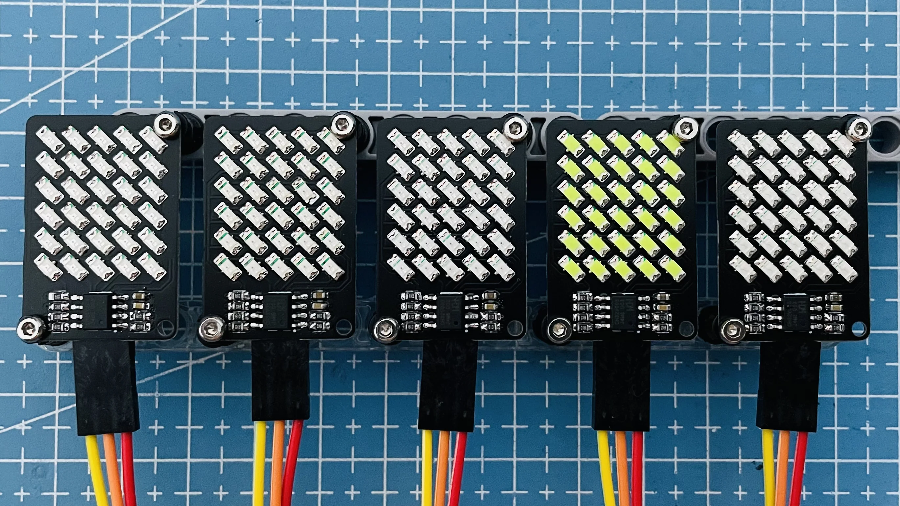

# CH32V003 Tristate Multiplexing LED

CH32V003J4M6 (SOP-8) drives 5x6 LED matrix.

I programmed 5 boards to work together. But as there is no communication among the boards, the boards will soon not in sync...

## Schematic

## References

- [Stefan Wagner: CH32V003 RISC-V Mini Game Console](https://github.com/wagiminator/CH32V003-GameConsole)
- [CNLohr: ch32v003fun](https://github.com/cnlohr/ch32v003fun)
- [Stefan Wagner: TinyProbe - Logic Probe based on ATtiny13A](https://github.com/wagiminator/ATtiny13-TinyProbe)
- [David Johnson-Davies: Twelve PWM Outputs from an ATtiny85](http://www.technoblogy.com/show?2H0K)
- [Wikipedia: Charlieplexing](https://en.wikipedia.org/wiki/Charlieplexing)
