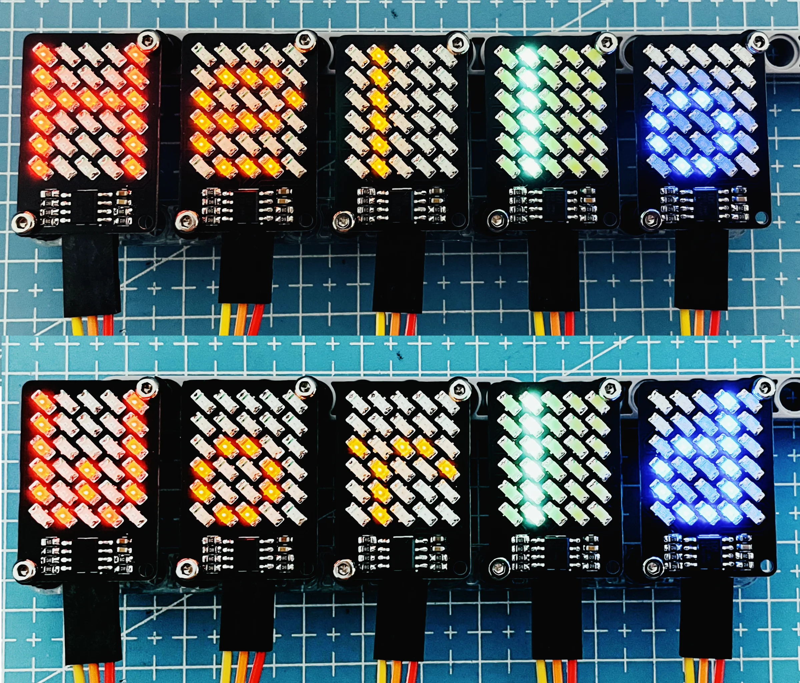
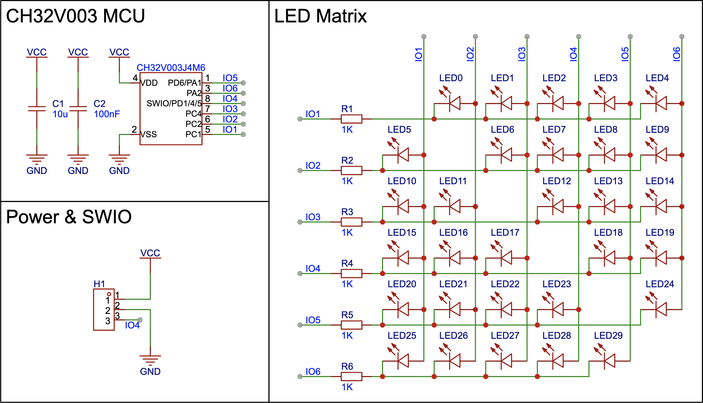
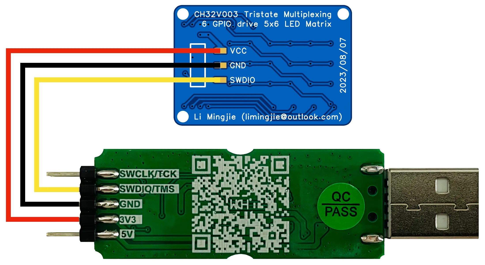

# CH32V003 Tristate Multiplexing LED

CH32V003J4M6 (SOP-8) drives a 5x6 LED matrix with only 6 GPIOs.

- EasyEDA: [https://oshwlab.com/mingjie/ch32v003-tristate-multiplexing-led](https://oshwlab.com/mingjie/ch32v003-tristate-multiplexing-led)
- YouTube: [LED Chaser Terminator - Low-Cost CH32V003 MCU Drives a 5x6 LED Matrix with 6 GPIOs - 555 Timer RIP!](https://www.youtube.com/watch?v=1Sye0EghZRU)
- Bilibili: [Ultra Low-Cost LED Chaser - 6 GPIOs Drive a 5x6 LED Matrix](https://www.bilibili.com/video/BV1tz4y1g7z6/)

I programmed 5 boards to show running words. But as there is no synchronization among the boards, the boards will soon run out of sync.



## Schematic



## How it works

The program uses the [Tristate Multiplexing (Charlieplexing)](https://en.wikipedia.org/wiki/Charlieplexing) technique to drive LEDs. Each GPIO is used as both row and column lines, so n GPIOs support `n x (n  - 1)` LEDs.

There is only one LED light at a time, and each LED supports 16 brightness levels. The program uses `SysTick` to update the LED matrix 50,000 times per second, so each LED updates at 50,000/30/16 = 104Hz, which is fast enough for human eyes to notice.

## Programming

To program the CH32V003 microcontroller, you will need a programmer that supports SWD.

- The official [WCH-LinkE](https://www.wch-ic.com/products/WCH-Link.html) programmer.
- Check [CNLohr's ch32v003fun](https://github.com/cnlohr/ch32v003fun) project for other options, such as ESP32S2 and Arduino-based programmers.

### Wiring the board to WCH-LinkE



## Compiling and Uploading (macOS)

Install [RISC-V Toolchain](https://github.com/riscv-software-src/homebrew-riscv).

```shell
brew tap riscv-software-src/riscv
brew install riscv-tools
```

This project uses the `minichlink` utility to upload, so the `libusb` is required as a dependency.

```shell
brew install libusb
```

Clone the project, connect the board to the programmer, then run the `make` command to compile and upload the firmware.

```shell
git clone https://github.com/limingjie/CH32V003-Tristate-Multiplexing-LED.git
cd CH32V003-Tristate-Multiplexing-LED
make
```

## Build `minichlink` Utility (macOS)

The `minichlink` utility in the `tools` library is built for `x86_64`. If your macOS runs on Apple Silicon, you can build the `minichlink` utility and copy it to the [tools](https://github.com/limingjie/CH32V003-Tristate-Multiplexing-LED/tree/main/tools) folder.

```shell
brew install pkg-config
brew install libusb
git clone https://github.com/cnlohr/ch32v003fun.git
cd ch32v003fun/minichlink
make
```

## References

- [Stefan Wagner: CH32V003 RISC-V Mini Game Console](https://github.com/wagiminator/CH32V003-GameConsole)
- [CNLohr: ch32v003fun](https://github.com/cnlohr/ch32v003fun)
- [Stefan Wagner: TinyProbe - Logic Probe based on ATtiny13A](https://github.com/wagiminator/ATtiny13-TinyProbe)
- [David Johnson-Davies: Twelve PWM Outputs from an ATtiny85](http://www.technoblogy.com/show?2H0K)
- [Wikipedia: Charlieplexing](https://en.wikipedia.org/wiki/Charlieplexing)
